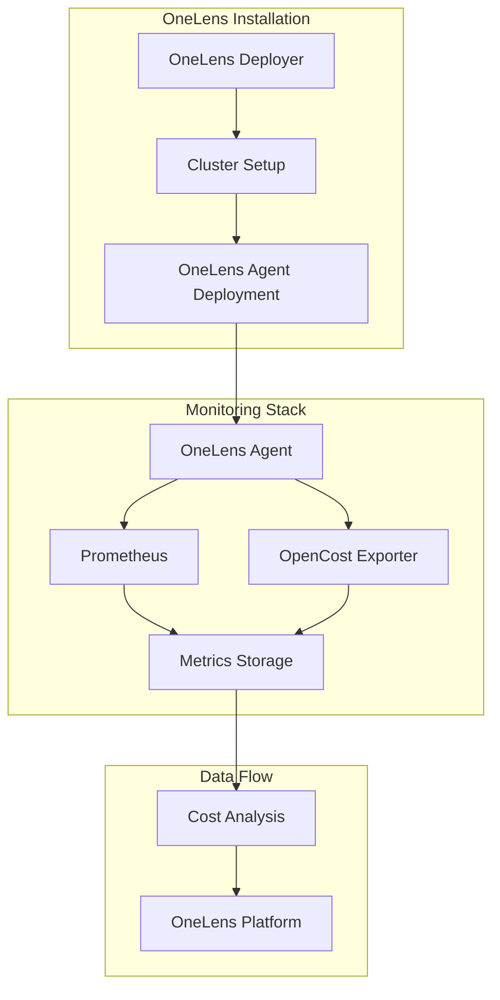

# OneLens Installation Scripts

> **Simplified Kubernetes cost optimization and monitoring deployment**

[](https://docs.onelens.cloud/integrations/kubernetes/onelens-agent/onboarding-a-k8s-cluster)
[](https://astuto-ai.github.io/onelens-installation-scripts/)
[](https://gallery.ecr.aws/w7k6q5m9/onelens-deployer)

## 📋 Overview

OneLens Installation Scripts provides automated deployment tools for setting up comprehensive Kubernetes cost monitoring and optimization infrastructure. This repository contains Helm charts and automation scripts to deploy OneLens agents and supporting monitoring stack.

## 🏗️ Components

### 🚀 OneLens Deployer
A Kubernetes job orchestrator that handles the initial setup and configuration of OneLens infrastructure in your cluster.

**Features:**
- One-time setup jobs
- Cluster configuration automation
- Cross-platform Docker images (AMD64/ARM64)

### 📊 OneLens Agent
The core monitoring agent that collects cost and resource utilization data from your Kubernetes cluster.

**Includes:**
- **OneLens Agent**: Main cost monitoring and optimization agent
- **Prometheus**: Metrics collection and storage
- **OpenCost Exporter**: Kubernetes cost metrics calculation
- **Custom Storage Classes**: Optimized storage configurations

## 🚀 Quick Start

### Prerequisites
- Kubernetes cluster (1.25+)
- Helm 3.0+
- kubectl configured for your cluster

### Installation

1. **Add the OneLens Helm repository:**
   ```bash
   helm repo add onelens https://astuto-ai.github.io/onelens-installation-scripts/
   helm repo update
   ```

2. **Deploy OneLens Deployer:**
   ```bash
   helm upgrade --install onelensdeployer onelens/onelensdeployer \
     --set job.env.CLUSTER_NAME=your-cluster-name \
     --set job.env.REGION=your-aws-region \
     --set-string job.env.ACCOUNT=your-aws-account-id \
     --set job.env.REGISTRATION_TOKEN="your-registration-token"
   ```

3. **Deploy OneLens Agent:**
   ```bash
   helm upgrade --install onelens-agent onelens/onelens-agent \
     --namespace onelens-system \
     --create-namespace
   ```

### Configuration

#### OneLens Deployer Configuration
| Parameter | Description | Default |
|-----------|-------------|---------|
| `job.env.CLUSTER_NAME` | Your Kubernetes cluster name | `""` |
| `job.env.REGION` | AWS region where cluster is located | `""` |
| `job.env.ACCOUNT` | AWS account ID | `""` |
| `job.env.REGISTRATION_TOKEN` | OneLens registration token | `""` |

#### OneLens Agent Configuration
| Parameter | Description | Default |
|-----------|-------------|---------|
| `onelens-agent.enabled` | Enable OneLens agent | `true` |
| `prometheus.enabled` | Enable Prometheus monitoring | `true` |
| `prometheus-opencost-exporter.enabled` | Enable cost metrics | `true` |
| `onelens-agent.cronJob.cronSchedule` | Data collection schedule | `"0 * * * *"` |

### Full install with labels (namespace, deployer Job/CronJob, and all agent deployments)

To apply the same labels to the **namespace**, the **deployer Job**, the **deployer CronJob** (updater), and **all components** created by the deployer (Prometheus, KSM, Pushgateway, OpenCost, onelens-agent cronjob), use **`globals.labels`**. If no labels are set, the install runs as usual with no extra pod labels.

When you pass **`globals.labels`**, the deployer job will also apply those labels to the **namespace** `onelens-agent`: if the namespace is created by Helm (`--create-namespace`), it is labeled automatically; if it already existed, its labels are updated. So you do not need to run `kubectl label namespace` yourself unless you want to label the namespace before the deployer runs.

1. **Create the namespace** (optional — omit if you use `--create-namespace` in step 2):
   ```bash
   kubectl create namespace onelens-agent
   ```

2. **Install the deployer with env, nodeSelector, tolerations, and shared labels** (`globals.labels` apply to the Job, CronJob, namespace, and—via the job pod—to every deployment). Use `--create-namespace` so Helm creates `onelens-agent` if missing; the job will then apply `globals.labels` to that namespace:
   ```bash
   helm upgrade --install onelensdeployer onelens/onelensdeployer -n onelens-agent --create-namespace \
     --set job.env.CLUSTER_NAME=browserstack-euc1-stag-001 \
     --set job.env.REGION=eu-central-1 \
     --set-string job.env.ACCOUNT=737963123736 \
     --set job.env.REGISTRATION_TOKEN=f06d12c1-2952-4017-bffb-149170ac6d35 \
     --set job.env.NODE_SELECTOR_KEY=purpose \
     --set job.env.NODE_SELECTOR_VALUE=eks-pvtci-generic-amd64 \
     --set job.env.TOLERATION_KEY=eks-pvtci-generic-amd64 \
     --set-string job.env.TOLERATION_VALUE="" \
     --set job.env.TOLERATION_OPERATOR=Exists \
     --set job.env.TOLERATION_EFFECT=NoSchedule \
     --set job.nodeSelector.purpose=eks-pvtci-generic-amd64 \
     --set 'job.tolerations[0].key=eks-pvtci-generic-amd64' \
     --set 'job.tolerations[0].operator=Exists' \
     --set 'job.tolerations[0].effect=NoSchedule' \
     --set cronjob.nodeSelector.purpose=eks-pvtci-generic-amd64 \
     --set 'cronjob.tolerations[0].key=eks-pvtci-generic-amd64' \
     --set 'cronjob.tolerations[0].operator=Exists' \
     --set 'cronjob.tolerations[0].effect=NoSchedule' \
     --set globals.labels."browserstack\.com/BillingTeam"=core \
     --set globals.labels."browserstack\.com/Env"=stag \
     --set globals.labels."browserstack\.com/Team"=infra \
     --set globals.labels."browserstack\.com/application"=onelens \
     --set globals.labels."browserstack\.com/component"=onelens \
     --set globals.labels."browserstack\.com/release"=ga
   ```

   - **Deployer Job** and **deployer CronJob** get `globals.labels` on their metadata.
   - The one-time Job passes these labels into the install script; the script applies them as **podLabels** to Prometheus, Kube-State-Metrics, Pushgateway, OpenCost, and the **onelens-agent CronJob** (hourly data collection).
   - The **updater CronJob** (runs once per day) also has `globals.labels` on its CronJob resource.

   To add labels only to the Job or only to the CronJob, use `job.labels` or `cronjob.labels` instead of (or in addition to) `globals.labels`; labels set in the job are also passed to the deployments created by that job.

## 📚 Documentation

- [🏗️ CI/CD Architecture](docs/ci-cd-architecture.md) - Complete CI/CD pipeline documentation
- [⚡ Quick Reference](docs/quick-reference.md) - Fast commands and troubleshooting
- [📖 Release Process](docs/release-process.md) - How to create new releases
- [🔄 CI/CD Flow](docs/ci-cd-flow.md) - Understanding the automation pipeline
- [⚙️ Configuration Guide](docs/configuration.md) - Detailed configuration options
- [🔧 Development Guide](docs/development.md) - Contributing and development setup

## 🛠️ Scripts & Tools

- [🔍 Pre-requisite Checker](scripts/prereq-check/README.md) - Automated environment validation script
- [📦 Tools Installation Guide](scripts/prereq-check/tools-installation.md) - Step-by-step installation for required tools

## 🔄 Architecture



## 🏷️ Versioning

This project follows [Semantic Versioning](https://semver.org/). Version history and release notes are available in:
- [OneLens Agent Versions](charts/onelens-agent/version.md)
- [Release Tags](https://github.com/astuto-ai/onelens-installation-scripts/releases)

## 🤝 Contributing

We welcome contributions! Please see our [Development Guide](docs/development.md) for details on:
- Setting up development environment
- Running tests
- Submitting pull requests


## 📞 Support

- 📧 Email: support@astuto.ai
- 📖 Documentation: [OneLens Docs](https://docs.onelens.cloud/integrations/kubernetes/onelens-agent/onboarding-a-k8s-cluster)
- 🐛 Issues: [GitHub Issues](https://github.com/astuto-ai/onelens-installation-scripts/issues)

## 🚀 What's Next?

After installation, your cluster will be monitored by OneLens. Visit the OneLens platform to:
- View real-time cost analytics
- Get optimization recommendations
- Set up cost alerts and budgets
- Analyze resource utilization trends

---

**Made with ❤️ by the OneLens Team**


